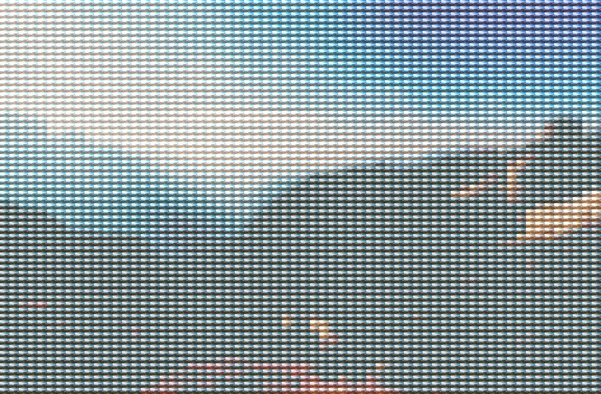

# imcollage

一个实现马赛克拼贴图像的算法。

源图片:

拼贴图片:

# Usage

	imcollage('img4.jpeg',64);

# Api

	function dest = imcollage(filename,segments)
	%IMCOLLAGE 将图像转换成由拼贴拼成的图像
	%   将图像转换成由拼贴拼成的图像
	% 输入：
	%     filename: 源图片路径
	%     segments: 分段数
	% 输出：
	%     dest: 生成的图片

# License

none.
